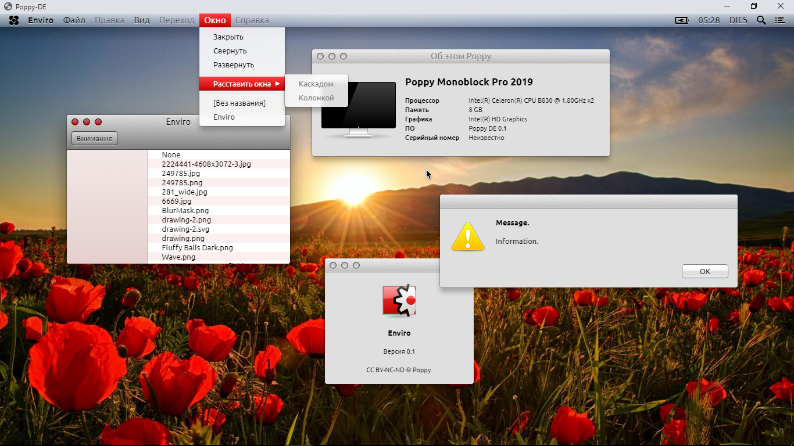

[RU](README.md) | **EN**

Poppy DE
--
Free OS X-like environment implementation.

The project is by no means a typical DE (as the name suggests) or an independent OS (as it might seem from its architecture), but it should be thought as a combination of these concepts. The choice of the abbreviation in the name is due to the widespread opinion that any real OS should communicate with hardware only directly (the exception is hypervisors), while DE, of course, do not have such a limitation.

Main project requirements:

	1. External compatibility with Cocoa interface and Aqua environment of version 10.9
	2. Internal similarities with OS X and NeXTSTEP architectures, and to a much lesser extent with BSD and Linux
	3. Intelligent, not blind (bug-to-bug) copying
	4. Run on Linux and Windows
	5. Multifunctional, controlled and pleasing to the eye PL, that uses optional/dynamic typing and interpretation/dynamic compilation

Boot process:

	Native software -> Opium Kernel, Kext's -> Libraries, services -> Framework's, App's

NW.JS was chosen as a development platform, as an environment that meets the requirements 4-6 as much as possible. JVM + Groovy was second thought, but they are not as well controllable. As an inevitable given, even at the current Alpha-stage of development, it is clear that performance does not reach the same heights as native applications. This is largely due to three factors: interpreted PL, improvements to its syntax, and processor rendering. In theory, the third problem is fixable by using WebGL, but in general, it is still very far to improve performance, since now the main goal is expanding of the functionality.

Note: The project has been frozen for an indefinite period due to the development of a new fully suitable PL.